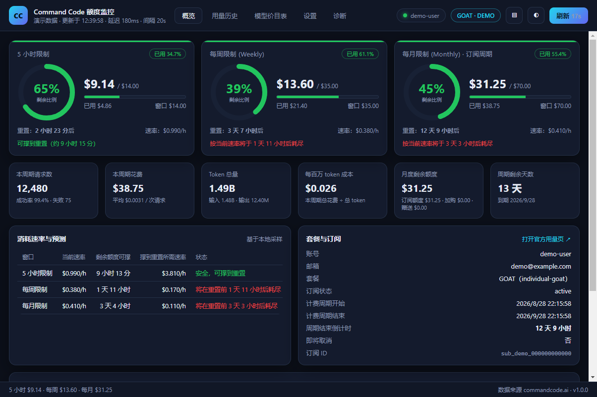
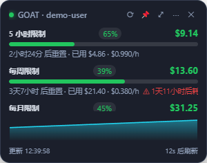
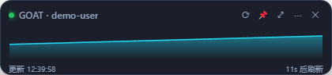
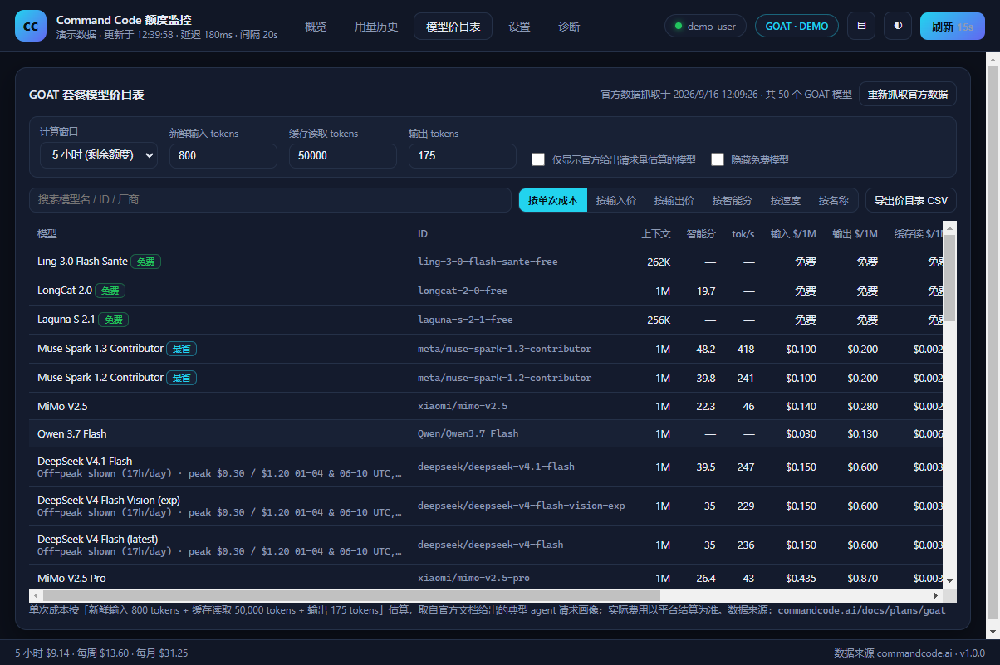
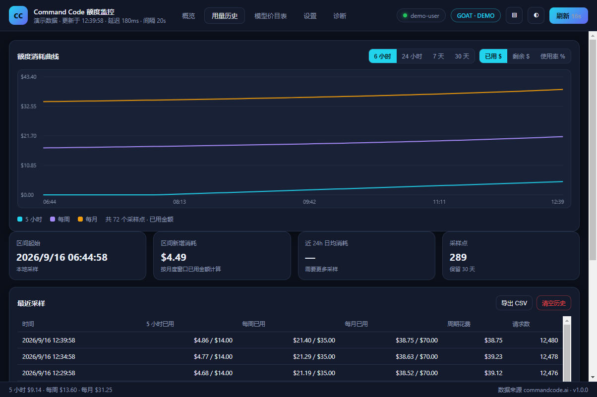
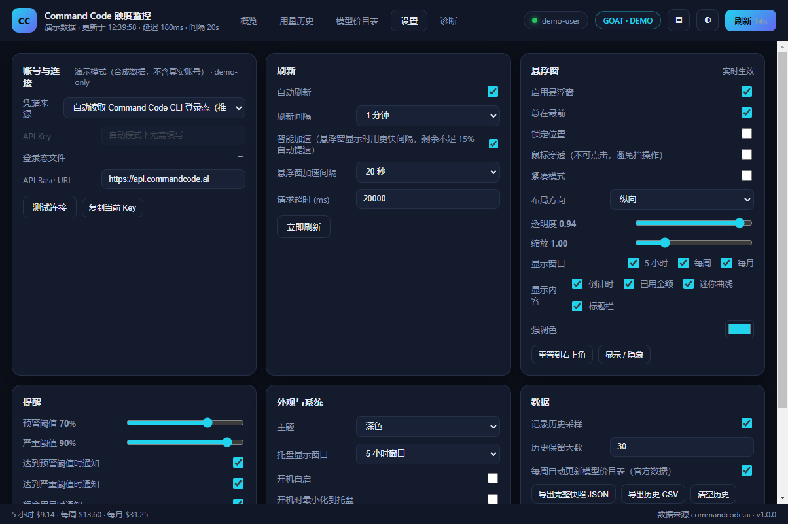
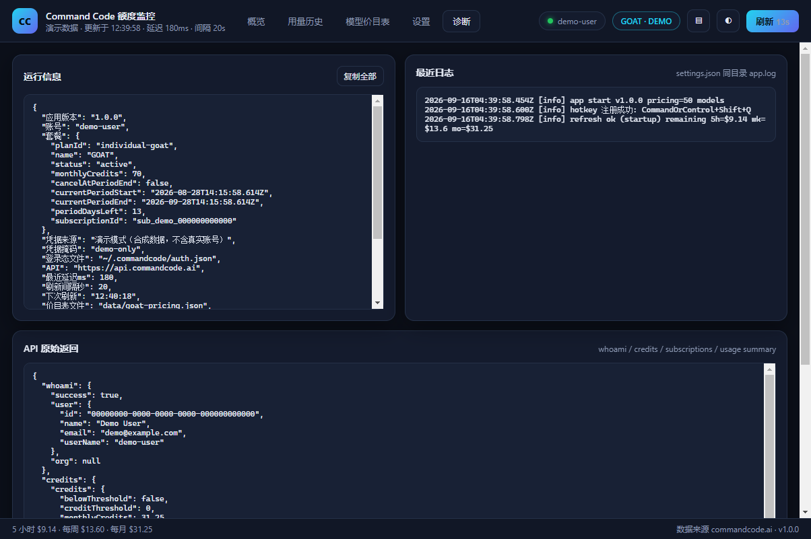

<div align="center">

# CC Quota Monitor · Command Code 额度监控

**实时看住 Command Code（commandcode.ai）GOAT 套餐的 5 小时 / 每周 / 每月额度、桌面悬浮窗常驻显示、内置全模型价目表**

[](LICENSE)
[](#-快速开始)
[](https://www.electronjs.org/)
[](https://nodejs.org/)
[](#-项目结构)

一个常驻托盘的桌面小组件：三条额度线（5 小时限制 / Weekly Limit / Monthly Limit）实时刷新，
悬浮窗贴在桌面角落随时可见，另附官方 GOAT 套餐 50 个模型的价目表与「剩余额度还能跑多少次」估算。
支持 Windows / macOS / Linux，**零第三方运行时依赖**（只用 Electron 本体 + Node 内置模块）。

<sub>Unofficial third-party tool. Not affiliated with Command Code. 本项目与 Command Code 官方无关。</sub>

</div>

---

## 📸 界面截图

> 以下截图由 `npm run shots:demo` 生成，使用**内置合成数据**（`--demo`），不含任何真实账号信息。

### 主面板 · 额度总览
三条额度线的环形进度、剩余金额、重置倒计时、消耗速率与耗尽预测。



### 桌面悬浮窗
无边框半透明、总在最前、可拖动吸附；每行显示剩余百分比 / 剩余金额 / 进度条 / 重置倒计时 / 当前速率。

<table>
<tr>
<td width="42%"></td>
<td width="58%"></td>
</tr>
<tr>
<td align="center"><sub>纵向模式（默认）</sub></td>
<td align="center"><sub>紧凑横向模式</sub></td>
</tr>
</table>

### 模型价目表
官方 GOAT 套餐 50 个模型的 $/1M tokens 单价、缓存价、官方请求量估算，以及按你的剩余额度算出的「还能跑多少次」。



### 用量历史
本地采样（每分钟一个点）绘制 6 小时 ~ 30 天曲线，可切换「已用 $ / 剩余 $ / 使用率 %」。



### 设置
账号来源、刷新策略、悬浮窗外观、提醒阈值、开机自启、数据导出。



---

## ✨ 功能特性

**额度监控**
- 三个额度窗口：**5 小时限制 / 每周限制 (Weekly Limit) / 每月限制 (Monthly Limit)**，各自显示剩余金额、剩余百分比、已用金额、总额度、重置倒计时（秒级跳动）。
- **消耗速率与耗尽预测**：基于本地采样自动计算 `$/小时`，推算「还能撑多久」「是否会在重置前耗尽」「要撑到重置每小时最多能花多少」，并按绿/黄/橙/红分档预警。
- 本周期统计：请求数、成功率、总花费、平均单次成本、token 出入量、每百万 token 成本、订阅剩余天数。

**桌面悬浮窗**
- 无边框、圆角、半透明，**总在最前**，独立于主窗口；拖动记忆位置、靠近边缘自动吸附、多显示器越界自动拉回。
- 紧凑横向模式、透明度 / 缩放（0.7×–2×）调节、强调色、逐项开关（倒计时 / 已用金额 / 迷你曲线 / 标题栏）。
- ⋯ 菜单：置顶、鼠标穿透、紧凑、横/纵向、锁定、贴边、重置位置、隐藏、退出。
- 鼠标穿透模式下用全局快捷键（默认 `Ctrl+Shift+Q`）一键唤回。

**模型价目表**
- 从官方文档抓取并解析的 GOAT 全部 50 个模型：上下文、智能分、输出速度、输入/输出/缓存读/缓存写单价、免费模型标记。
- 支持搜索与排序（单次成本 / 输入价 / 输出价 / 智能分 / 速度 / 名称）。
- **剩余额度还能跑多少次**：按官方给出的典型 agent 请求画像（800 新鲜输入 + 50,000 缓存读 + 175 输出 tokens）计算单次成本，再除以所选窗口的剩余额度；画像参数可现场修改。
- 一键导出 CSV；启动时若数据超过 7 天会在后台自动更新。

**刷新 / 提醒 / 托盘**
- 自动刷新 15 秒 ~ 10 分钟可选；**智能加速**：悬浮窗可见时用更短间隔，任一窗口剩余低于 15% 时自动把间隔减半。
- 窗口获得焦点、系统唤醒 / 解锁、CLI 重新登录（`auth.json` 变化）时立即刷新；失败自动退避重试并保留上次数据。
- 阈值提醒（默认 70% 预警 / 90% 严重）、额度用尽提醒、窗口即将重置提醒，点击通知直达主面板。
- 托盘图标是**实时绘制的进度环 + 剩余百分比数字**，颜色随使用率变化；悬停显示三条额度线详情；右键菜单可切刷新间隔、切托盘显示窗口。

**其它**
- 历史曲线 + CSV/JSON 导出、深浅色主题、开机自启、启动最小化到托盘、关闭到托盘、全局快捷键、诊断页（原始 API 返回 / 日志 / 延迟）。

---

## 🔐 它是怎么连上你的账号的？

**不需要 OAuth、不需要重新登录、不接触密码。** 它直接复用你本机 Command Code CLI 的登录态：

```
① 你在本机跑过 command-code CLI 并登录
        ↓  登录后 CLI 会把凭据写入
   %USERPROFILE%\.commandcode\auth.json      (Windows)
   ~/.commandcode/auth.json                  (macOS / Linux)
        ↓  内容形如
   { "apiKey": "user_xxx...", "userId": "...", "userName": "...", "authenticatedAt": "..." }
        ↓  本应用启动 / 每次刷新时读取
② 带上这个 apiKey 调用官方用量接口
   Authorization: Bearer <apiKey>
```

请求的接口（与 CLI 内置的 `/usage` 面板完全同源）：

| 接口 | 用途 |
| --- | --- |
| `GET /alpha/whoami?limits=1` | 账号 / 组织 |
| `GET /alpha/billing/credits?orgId=` | 月度剩余额度 + **5 小时 / 每周窗口**的 used / cap / resetAt |
| `GET /alpha/billing/subscriptions?orgId=` | 套餐 planId（`individual-goat`）、状态、计费周期起止 |
| `GET /alpha/usage/summary?orgId=&since=` | 本周期请求数 / 花费 / token |

默认 Base URL 为 `https://api.commandcode.ai`（可在设置里改成自建网关或 staging）。

**三种凭据来源**（设置 → 账号与连接）：

1. **自动（默认）**：读取上面的 `auth.json`，CLI 重新登录后应用会监听文件变化自动生效；
2. **手动**：直接粘贴一个 `user_...` 开头的 API Key（适合 CLI 装在别的机器上、或有多把 Key 的场景）；
3. **演示模式**：`npm start -- --demo`，使用内置合成数据，不读取任何真实凭据。

### 额度口径

| 窗口 | 额度 | 计算方式 |
| --- | --- | --- |
| 5 小时限制 | $14 | 接口返回的 `fiveHour.used / cap / resetAt` |
| 每周限制 Weekly | $35 | 接口返回的 `weekly.used / cap / resetAt` |
| 每月限制 Monthly | $70 | `总额度 = max(套餐额度, 剩余月度额度) + 加购 + 赠送`；`剩余 = monthlyCredits + purchasedCredits + freeCredits`；重置时间 = 订阅周期结束时间 |

> 其他套餐的月度额度（内置表）：Go 10 / GOAT 70 / Pro 30 / Pro v1 80 / Provider 15 / Max 150 / Ultra 300 / Teams Pro 40。
> 网页 Studio 与本应用同为实时值；「每月」口径与官方 `/usage` 面板一致。

---

## 🔒 隐私与安全

- **凭据只在你本机流转**：应用只把 `apiKey` 作为请求头发往 `api.commandcode.ai`，没有自建服务器、没有遥测、没有埋点。
- **不落盘明文密钥**：默认模式不复制、不缓存 `auth.json` 里的密钥；界面只显示掩码（`user_4HP2g…8AiSp1`）。手动模式填写的 Key 会存在本机 `settings.json` 中（仅本机用户可读）。
- **数据全部本地**：设置、采样历史、日志都在 Electron 的 `userData` 目录，随时可在「设置 → 数据」里导出或清空。
- **演示模式完全隔离**：`--demo` 使用独立的临时目录与合成数据，不读取登录态、不写入真实历史。
- 仓库自带 `scripts/privacy-scan.mjs` 隐私扫描（CI 会跑），确保提交的内容里没有本机路径、API Key、订阅 ID、邮箱等个人信息。

---

## 🚀 快速开始

**环境要求**：Node.js ≥ 18（推荐 20+），npm。

```bash
git clone <your-fork-url> cc-quota-monitor
cd cc-quota-monitor
npm install          # 首次安装会下载 Electron 运行时
npm start            # 启动
```

Windows 用户也可以直接双击 `start.bat`。

### 不想登录？先看演示模式

```bash
npm start -- --demo
```

使用内置合成数据渲染完整界面（截图里的那些数字就是它），不需要账号、不联网、不读真实凭据。

> 如果 Electron 二进制下载缓慢，可指定镜像后重试：
> ```bash
> # Windows PowerShell
> $env:ELECTRON_MIRROR="https://npmmirror.com/mirrors/electron/"; npm install
> # macOS / Linux
> ELECTRON_MIRROR="https://npmmirror.com/mirrors/electron/" npm install
> ```
> 也可以用本机已缓存的版本：把 `package.json` 里的 `electron` 改成缓存中的版本号再安装。

---

## ⌨️ 快捷键与托盘

| 操作 | 说明 |
| --- | --- |
| `Ctrl/Cmd + Shift + Q` | 悬浮窗：隐藏 → 显示 → **穿透中时关闭穿透**（逃生键） |
| 托盘左键 | 打开主面板 |
| 托盘右键 | 菜单：打开主面板、显示悬浮窗、悬浮窗总在最前、鼠标穿透、立即刷新、刷新间隔、托盘显示窗口、打开网页用量页、打开设置、重置悬浮窗位置、退出 |

悬浮窗标题栏可直接拖动，窗口位置会自动记忆；`⋯` 菜单里可以开关置顶、鼠标穿透、紧凑模式、方向、锁定与贴边吸附。

---

## ⚙️ 设置速查

| 分组 | 可调项 |
| --- | --- |
| 账号与连接 | 凭据来源（自动/手动）、API Key、API Base URL、测试连接 |
| 刷新 | 自动刷新、间隔（15s~10min）、智能加速、悬浮窗加速间隔、请求超时 |
| 悬浮窗 | 启用、置顶、锁定、鼠标穿透、紧凑、方向、透明度、缩放、显示项、强调色、重置位置 |
| 提醒 | 预警/严重阈值、用尽提醒、重置提醒、测试通知 |
| 外观与系统 | 主题、托盘显示窗口、开机自启、启动最小化、关闭到托盘、全局快捷键 |
| 数据 | 历史开关、保留天数、价目表自动更新、导出 JSON/CSV、清空历史、恢复默认 |

配置文件位置：

```
Windows  %APPDATA%\Command Code Quota Monitor\{settings,history}.json + app.log
macOS    ~/Library/Application Support/Command Code Quota Monitor/
Linux    ~/.config/Command Code Quota Monitor/
```

---

## 🧪 自检与打包

```bash
node scripts/selftest.mjs        # 纯逻辑自检（无需 GUI / 网络 / 账号），CI 使用
node scripts/privacy-scan.mjs    # 隐私扫描：确认仓库无个人信息
npm run verify                   # Electron 全自动验收：渲染各页面 + 21 项交互自检 + 控制台错误
npm run verify:demo              # 同上，使用演示数据
npm run shots:demo               # 生成演示截图到 docs/screenshots/
npm run pricing                  # 重新抓取官方价目表
npm run icons                    # 由 assets/logo.png 生成应用图标
```

打包成安装包 / 免安装 exe（需要额外装打包器）：

```bash
npm i -D electron-builder
npx electron-builder --win nsis portable     # Windows
npx electron-builder --mac dmg               # macOS
npx electron-builder --linux AppImage        # Linux
```

> 打包前请先 `npm run icons`，`build/icon.ico` 会被 electron-builder 自动采用。

---

## 🗂 项目结构

```
cc-quota-monitor/
├─ assets/                     # 放你自己的 logo.png（npm run icons 会用它生成图标）
├─ build/                      # 生成的应用图标（icon.png / icon.ico / ...）
├─ data/
│  ├─ goat-pricing.json        # GOAT 价目表（脚本生成、可提交）
│  └─ .cache/                  # 官方文档 HTML 缓存（gitignore）
├─ docs/screenshots/           # README 用的演示截图（--demo 生成，无个人信息）
├─ scripts/
│  ├─ fetch-pricing.mjs        # 价目表抓取 / 解析（也可被主进程调用）
│  ├─ make-icons.mjs           # 图标生成（含 PNG 解码 / 缩放 / ICO 打包）
│  ├─ png-io.mjs               # 零依赖 PNG 解码 + 缩放 + ICO 封装
│  ├─ selftest.mjs             # 纯逻辑自检（CI）
│  └─ privacy-scan.mjs         # 隐私扫描（CI）
└─ src/
   ├─ main/                    # 主进程（Node 环境）
   │  ├─ main.js               # 窗口 / 托盘 / 调度 / 通知 / IPC / 自检模式
   │  ├─ api.js                # 用量 API 客户端 + 数据归一化
   │  ├─ credentials.js        # 读取 CLI 登录态 / 手动 Key（监听文件变化）
   │  ├─ store.js              # 设置 / 历史 / 日志持久化（原子写入）
   │  ├─ pricing.js            # 价目表加载、单次成本与容量估算
   │  ├─ demo.js               # 演示模式合成数据
   │  ├─ png.js                # 零依赖 PNG 编码 + 托盘进度环图标绘制
   │  └─ preload.js            # contextBridge 安全桥接
   └─ renderer/                # 渲染进程（无框架、无构建步骤）
      ├─ index.html/.css/.js   # 主面板：概览 / 历史 / 价目表 / 设置 / 诊断
      └─ widget.html/.css/.js  # 桌面悬浮窗
```

技术选型：**Electron + 原生 DOM（无框架、无打包器、零运行时依赖）**，图标与 PNG 编解码也是自己实现的，`node_modules` 里只有 Electron 本体。

---

## ❓ FAQ

**Q：显示「未连接」或者 401？**
先确认本机跑过 `command-code` CLI 并登录过（会生成 `~/.commandcode/auth.json`）；或在「设置 → 账号与连接」切成手动模式粘贴 API Key，点「测试连接」验证。

**Q：数字和网页对不上？**
三条线都是实时值。注意「每月」= 套餐额度 − 当前剩余额度，若你买过加购额度会一并计入总额度。

**Q：悬浮窗点不动了？**
你开了「鼠标穿透」。按 `Ctrl+Shift+Q`，或从托盘菜单关掉悬浮窗再打开。

**Q：悬浮窗上的按钮点不动 / 鼠标穿透了怎么办？**
「鼠标穿透」开启后悬浮窗**故意**不接收鼠标事件（这样它就不会挡住你下面的操作）。三种恢复方式，任选其一：

1. 按全局快捷键 `Ctrl + Shift + Q`（在悬浮窗可见且穿透中时，这个快捷键的作用就是**关闭穿透并把它带到最前**）；
2. 托盘图标右键 → 取消勾选 **「鼠标穿透（开启后悬浮窗不响应点击）」**；
3. 打开主面板 → 设置 → 悬浮窗 → 关闭「鼠标穿透」。

穿透期间悬浮窗底部会显示一条黄色提示「穿透中 · Ctrl + Shift + Q 恢复」，开启时也会弹一条系统通知说明如何退出，不会让你卡在里面。

**Q：悬浮窗隐藏到哪去了？**
按 `Ctrl + Shift + Q`、托盘菜单「显示悬浮窗」，或托盘菜单「重置悬浮窗位置」（把它拉回主屏右上角）。

**Q：接口会不会变？**
这些接口是从 CLI 逆向出来的未公开接口，官方调整后可能需要适配。遇到问题请看「诊断」页的原始返回，欢迎提 Issue / PR。

<details>
<summary>诊断页长什么样（展开查看）</summary>



</details>

**Q：多久刷新一次比较好？**
默认 60 秒。想更灵敏可以设 15~30 秒并开启智能加速。

---

## 📄 许可与致谢

- 代码以 [MIT License](LICENSE) 开源。
- 数据来源：[commandcode.ai](https://commandcode.ai) 官方文档与用量接口；接口用法参考官方 `command-code` CLI。
- 本项目为第三方非官方工具，与 Command Code 官方无关联；Command Code 及其相关标识归其所有者所有。
- 请遵守所在平台的服务条款使用，额度与计费以官方页面为准。
